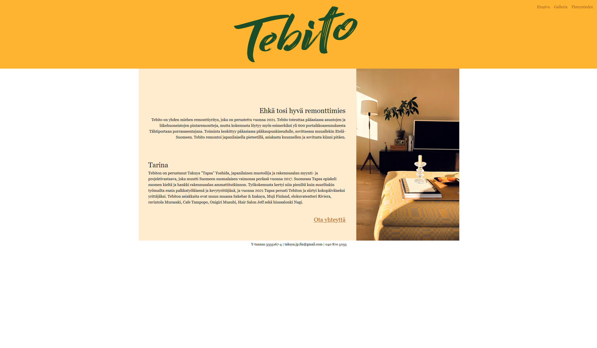

# Tebito - verkkosivut remonttiyritykselle
Tekijä: Saara Orvas

Responsiiviset ja selkeät verkkosivut suomalaiselle remonttiyritykselle. Sivusto esittelee yrityksen, sen palvelut ja aiemmat työt.

## Sisällysluettelo

- [Tietoja sovelluksesta](#tietoja-sovelluksesta)
- [Kuvakaappaus](#kuvakaappaus)
- [Teknologiat](#teknologiat)
- [Asennus](#asennus)
- [Kiitokset](#kiitokset)
- [Lisenssi](#lisenssi)

## Tietoja sovelluksesta
Verkkosivut ovat toteutettu osana Laurea ammattikorkeakoulun opintojaksoa *Verkkosivujen kehittäminen*. Sivusto on suunniteltu ja rakennettu Tebito-remonttiyrityksen käyttöön.

Sivustolla on:
- Etusivu, jossa esitellään omistaja Takuya Yoshida ja yrityksen tausta
- Galleria aikaisemmista töistä
- Yhteystiedot 

## Kuvakaappaus
Etusivu näyttää tältä:

## Teknologiat
Verkkosivujen toteutuksessa on käytetty seuraavia teknologioita:

- HTML
- CSS
- Bootstrap 5

## Asennus
1. Lataa tai kloonaa tämä repositorio
2. Avaa index.html selaimessa

Sivusto ei vaadi palvelinta tai erillistä asennusta.

## Kiitokset
Verkkosivujen toteutuksessa hyödynnettiin seuraavia lähteitä:

- [W3Schools](https://www.w3schools.com/)

## Lisenssi
Tämä projekti on lisensoitu MIT-lisenssillä. Katso `LICENSE`-tiedosto lisätietoja varten.